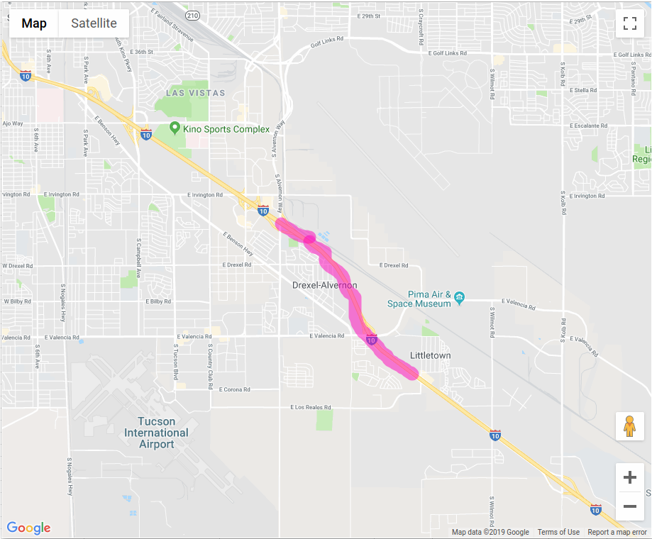
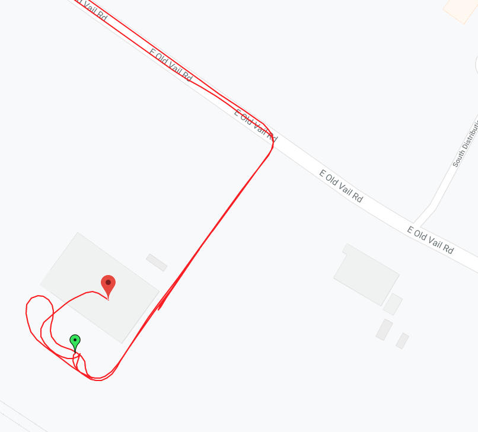

# Select trip segments
We pick trip segments from local road trip for stationary status and I-10 free way for straight moving and cornering status.
The segment are extracted by thresholding `azimuth`, and `latitude` or `longitude`. The extraction criteria are independent to the time.

## Stationary 

## Straight moving

## Cornering

