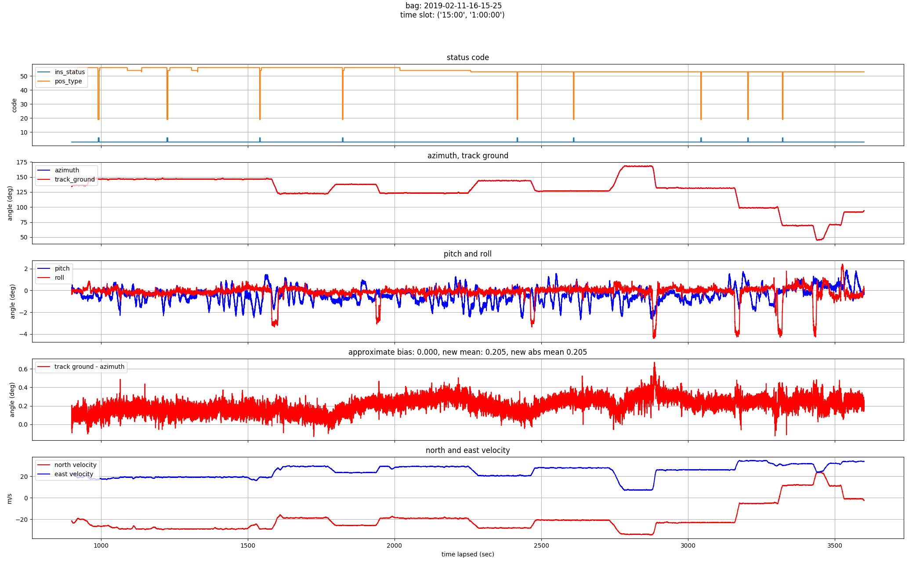
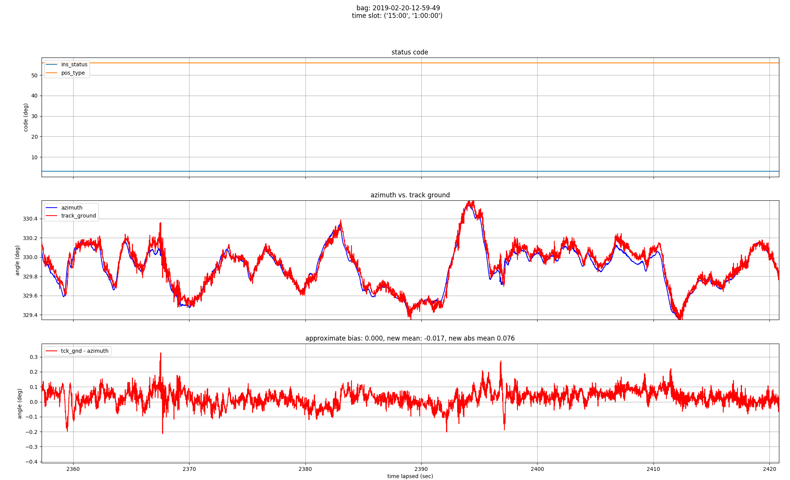
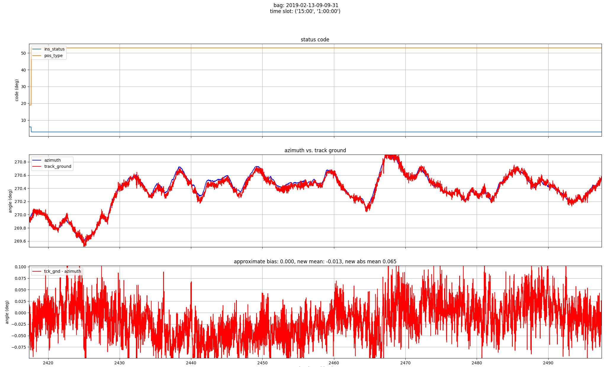

# Notes
- There is a relative constant offset between azimuth and track ground.
- The azimuth, track ground, and their difference are more stable than MKZ1 and trucks.

**MKZ2 overview**

**MKZ2 segment view a**

**MKZ2 segment view b**

