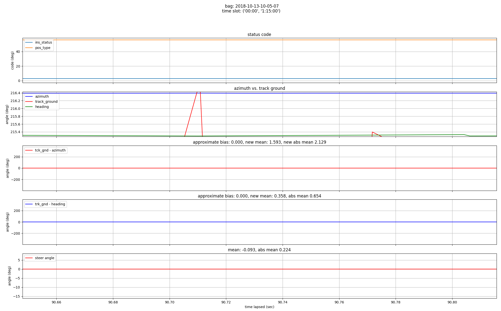
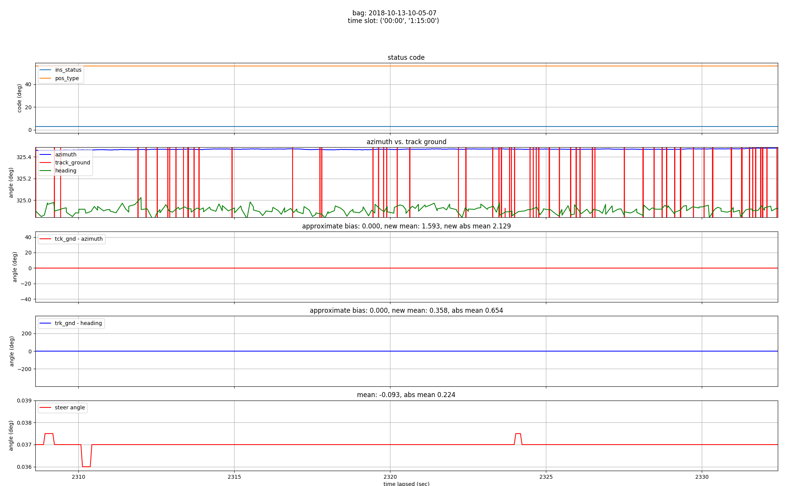
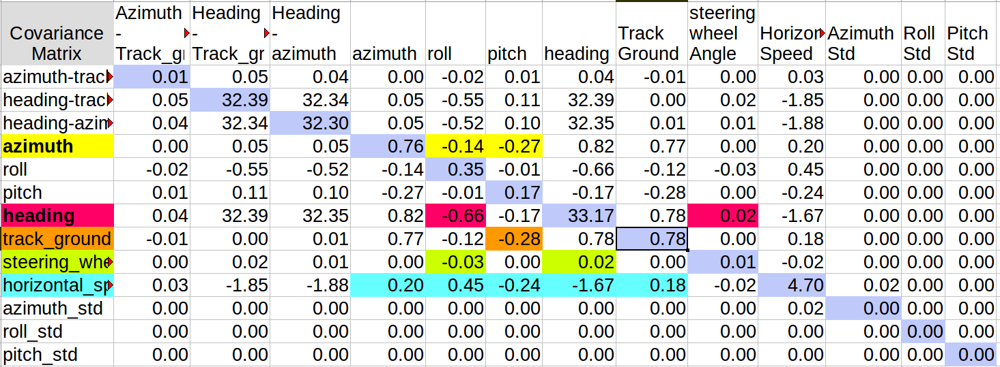
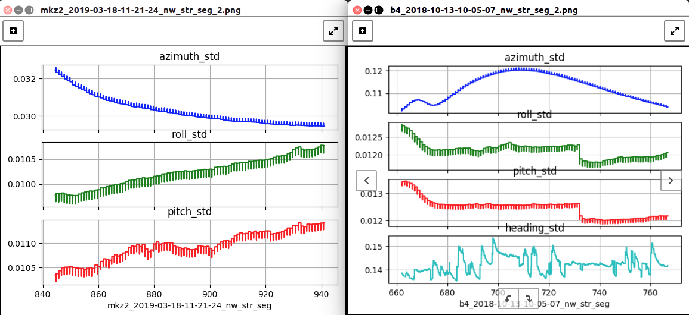

There is about 1 deg difference between azimuth and heading when initial stationary status.

There is about 0.5 deg difference between azimuth and heading when middle stationary status.

The covariance matrix of the vehicle states is as the below.

There is obvious azimuth std difference between MKZ2 and B4 at a straight trip segment.

